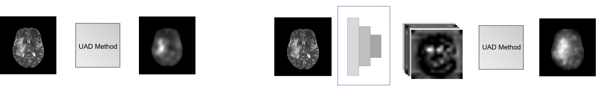

# Official Repository of: "TBD"
This repository contains the code to reproduce all experiments from the paper.

Abstract: Deep unsupervised approaches are gathering increased attention in the field of medical pathology detection and segmentation since they promise to alleviate labeled data bottlenecks and be more generalizable than their supervised counterparts in detecting any kind of rare pathology. As Unsupervised Anomaly Detection (UAD) literature continuously grows and new paradigms emerge, it is vital to continuously evaluate and benchmark new methods in a common context, in order to reassess the state-of-the-art (SOTA) and identify promising research directions. To this end, we evaluate a diverse selection of cutting-edge UAD methods on multiple medical datasets, pitting them against the established SOTA in brain MR. Our experiments demonstrate that newly developed Feature-space methods from the industrial and medical literature demonstrate increased performance compared to previous work and set the new SOTA in a variety of modalities and datasets. Additionally, we show that such methods are in principle capable of benefiting from recently developed self-supervised pre-training algorithms, further increasing their performance. Finally, we perform a series of experiments in order to gain further insights into some unique characteristics of selected models and datasets.



If you find our work useful for your research, please consider citing:


# Usage

Download this repository by running

```bash
git clone https://github.com/iolag/UPD_study/
```

in your terminal.

## Environment

Create and activate the Anaconda environment:

```bash
conda env create -f environment.yml
conda activate upd
```

Additionally, you need to install the repository as a package:

```bash
python3 -m pip install --editable .
```

To be able to use [Weights & Biases](https://wandb.ai) for logging follow the instructions at https://docs.wandb.ai/quickstart.
<!-- 
A quick guide on the folder and code structure can be found [here](structure.md). -->

## Data

### CheXpert 

To download CheXpert you must first register at https://stanfordmlgroup.github.io/competitions/chexpert/. After you receive the subscription confirmation e-mail, download the downsampled version (~11G) and extract the CheXpert-v1.0-small folder in data/datasets/CXR. No other steps are required and all splits are provided.

### DDR 

To download and prepare the DDR dataset, run:

```bash
bash UPD_study/data/data_preprocessing/prepare_DDR.sh
```

### MRI: CamCAN, ATLAS, BraTS 

To download and preprocess ATLAS and BraTS, first download ROBEX from https://www.nitrc.org/projects/robex  and extract it in data/data_preprocessing/ROBEX. Then run:

```bash
bash UPD_study/data/data_preprocessing/prepare_ATLAS.sh
bash UPD_study/data/data_preprocessing/prepare_BraTS.sh
```
For ATLAS you need to apply for the data at https://fcon_1000.projects.nitrc.org/indi/retro/atlas.htm and receive the encryption password. During the run of prepare_ATLAS.sh you will be prompted to input the password.

For BraTS, Kaggle's API will be used to download the data. To be able to interact with the API, follow the instructions at https://www.kaggle.com/docs/api.

To download the CamCAN data, you need to apply for it at https://camcan-archive.mrc-cbu.cam.ac.uk/dataaccess/index.php. After you download them, put them in data/datasets/MRI/CamCAN and run:

```bash
python UPD_study/data/data_preprocessing/prepare_data.py --dataset CamCAN
```

## Experiments

To generate the "Main Results" from Tables 1 and 3 over all three seeds run:
```bash
bash UPD_study/experiments/main.sh 
```
Alternatively, for a single seed run:

```bash
bash UPD_study/experiments/main_seed10.sh 
```


To generate the "Self-Supervised Pre-training" results from Tables 2 and 4 over all three seeds run:
```bash
bash UPD_study/experiments/pretrained.sh
```
Alternatively, for a single seed run:

```bash
bash UPD_study/experiments/pretrained_seed10.sh      
```

To generate the "Complexity Analysis" results from Table 5 run:
```bash
bash UPD_study/experiments/benchmarks.sh
```

To generate "The Effects of Limited Training Data" results from Fig. 3 run:
```bash
bash UPD_study/experiments/percentage.sh
```


